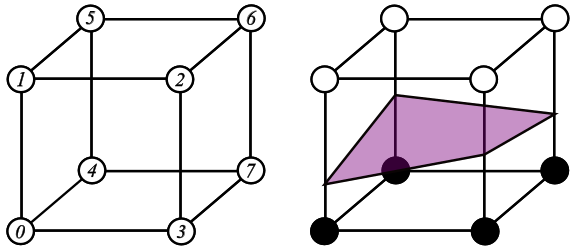

# IsoSurfaceGen

This project presents implementations of various algorithms 
for creating polygonal meshes from implicit surfaces.

## Algorithms

- Marching Cubes on uniform grids 
- Surface Nets on uniform grids 
- Dual Contouring on uniform grids 
- Adaptive Surface Nets

## Marching Cubes on uniform grids

The Marching Cubes algorithm (Lorensen & Cline, 1987) works
by following the next steps:

### 1. Dividing the 3D space into a grid of cubes.

This is straightforward. We simply divide the 
required space into a grid of cubes (voxels). 
This can be done by calculating the surface's 
bounding box or choosing an arbitrary size that 
encapsulates the shape.For simplicity,
I chose the second method.

### 2. Evaluating our implicit surface at each voxel’s corners.

First, we evaluate the surface at each voxel's corner to see if it falls inside or outside the surface. Based on that, we create a binary index for each grid cell by concatenating the inside/outside classification of its eight corners in a fixed order.

For a cube with corners labeled 7-6-5-4-3-2-1-0, each corner contributes a 1 if it is inside the surface and 0 if it is outside. This forms an 8-bit binary number, where the most significant bit corresponds to corner 7 and the least significant bit to corner 0.

For example, if corners 7, 6, 5 and 4 are inside the surface, while the rest are outside, the binary index is 11110000(=240).

| corner evaluation |
|---|
|   |

  

| corner evaluation |
|---|
| 

  

  |

## Surface Nets on uniform grids
