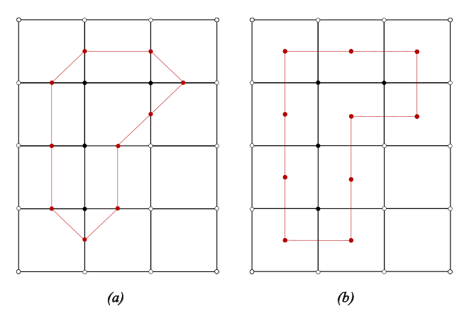
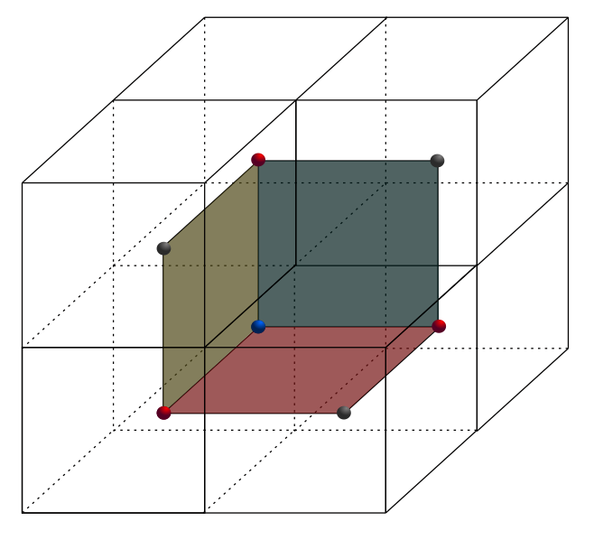
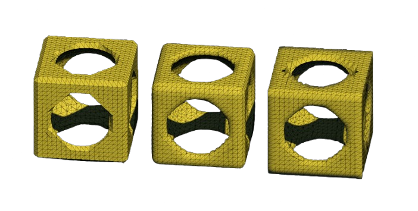
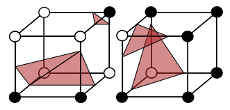
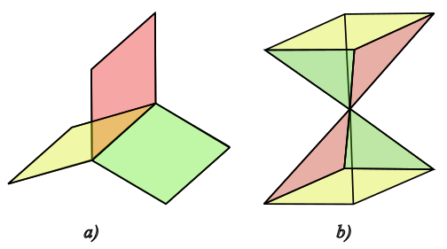
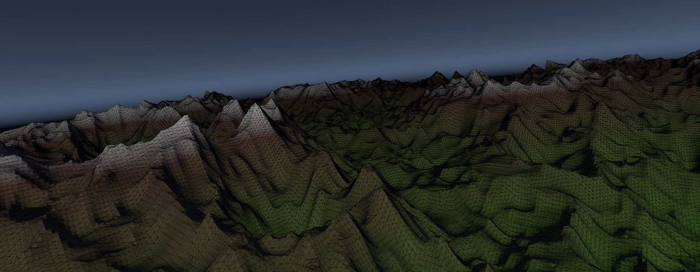
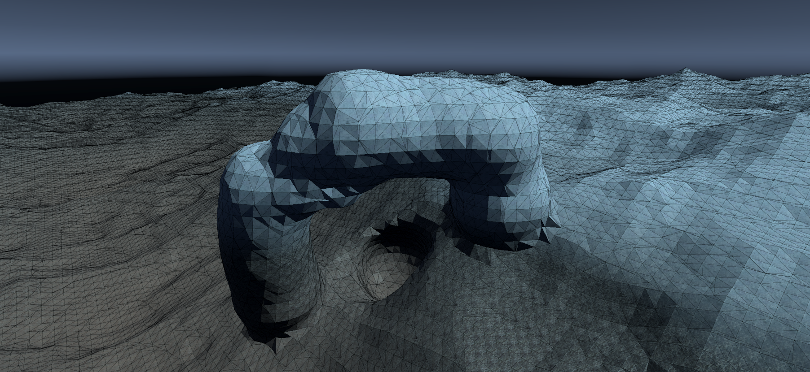
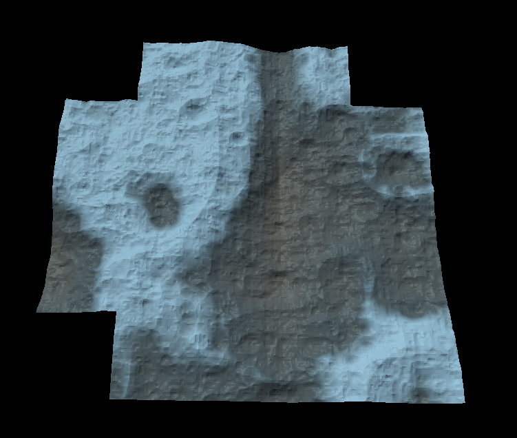

# IsoSurfaceGen

This project presents implementations of various algorithms 
for creating polygonal meshes from implicit surfaces.

## Algorithms

- Marching Cubes on uniform grids 
- Surface Nets on uniform grids 
- Dual Contouring on uniform grids 
- Adaptive Surface Nets

## Marching Cubes on uniform grids

The Marching Cubes algorithm (Lorensen & Cline, 1987) works
by following the next steps:

### 1. Dividing the 3D space into a grid of cubes.

This is straightforward. We simply divide the 
required space into a grid of cubes (voxels). 
This can be done by calculating the surface's 
bounding box or choosing an arbitrary size that 
encapsulates the shape.For simplicity,
I chose the second method.

### 2. Evaluating our implicit surface at each voxel’s corners.

First, we evaluate the surface at each voxel's corner to see if it falls inside or outside the surface. Based on that, we create a binary index for each grid cell by concatenating the inside/outside classification of its eight corners in a fixed order.

For a cube with corners labeled 7-6-5-4-3-2-1-0, each corner contributes a 1 if it is inside the surface and 0 if it is outside. This forms an 8-bit binary number, where the most significant bit corresponds to corner 7 and the least significant bit to corner 0.

For example, if corners 7, 6, 5 and 4 are inside the surface, while the rest are outside, the binary index is 11110000(=240).

  

## Surface Nets on uniform grids

Surface Nets is an alternative algorithm for isosurface extraction, known for its simplicity and the smoother quality of the generated surfaces. Unlike Marching Cubes, SurfaceNets places a single node inside each grid cell that is intersected and constructs polygons by connecting these nodes, resulting in a more regular topology.

Instead of placing triangles directly, as in the case of Marching Cubes, the Surface Nets algorithm places a single node for each voxel that the surface passes through. This node represents the point where the surface intersects the voxel and is calculated as the average of the intersection points along the edges where the value sign changes — that is, edges with one vertex inside the surface and the other outside.

  

After placing a representative node in each voxel that contains a portion of the surface, the next step is to construct the polygonal mesh by connecting these nodes between adjacent voxels. Instead of analyzing all six possible directions, only the three neighbors in the positive directions (for example, to the right, upward, and forward) are checked, ensuring that each pair of adjacent voxels is processed only once, thus avoiding duplicate connections.

  

## Dual Contouring on uniform grids

Dual Contouring is an isosurface extraction algorithm that operates on a principle similar to that of Surface Nets but often produces more accurate results when representing complex shapes.

To accurately compute the position of the nodes, Hermite data is collected for each edge that intersects the implicit surface. This data consists of the position of the intersection point between the edge and the surface, as well as the surface normal at that point. These values are then used to construct a Quadratic Error Function (QEF), whose minimization determines the optimal position of the node in the polygonal mesh.

Because this step is quite mathematically intensive and would take some time to explain properly, I will omit it here, but I have linked a good source for further details.

## Comparing the algorithms

In terms of accuracy, Dual Contouring generally provides the highest fidelity among the three algorithms. It preserves sharp edges and corners using Hermite data and optimization, closely matching the true surface geometry.

Marching Cubes, while widely used and capable of generating detailed surfaces, often smooths out sharp features due to fixed triangulation patterns and vertex interpolation, leading to artifacts in high-curvature areas.

Surface Nets produce smoother and more stable surfaces by averaging edge intersections within each voxel but tend to lose fine details, especially around sharp edges.

In summary, Dual Contouring offers the best precision, but the choice of algorithm depends on the application's specific needs—whether for geometric detail or surface smoothness.

The image below shows the results of each algorithm. From left to right: Marching Cubes, Surface Nets, and Dual Contouring.

  

From a topological perspective, each of the presented algorithms has certain issues in its current form.

Although widely used, the Marching Cubes algorithm has a well-known major issue related to surface construction ambiguity. Because it relies on a predefined lookup table without additional refinement, multiple valid configurations can exist for a given case. Without extra information, the table's selection may result in a polygonal mesh that is not fully connected.

  

Unlike Marching Cubes, both Surface Nets and Dual Contouring are able to generate watertight surfaces. However, none of the presented algorithms produce a polygonal mesh that is a 2-dimensional topological manifold. Such a surface requires that every edge is shared by exactly two faces, and around each vertex, the faces must connect in a way that is topologically equivalent to a disk (i.e., locally, the surface resembles a flat plane).

If this property is violated — for example, if an edge is shared by more than two faces (a) , or if the neighborhood around a vertex is not continuously connected (b) — then the mesh is not a 2-manifold.

  

## Infinite procedural terrain

  

  

  

## Bibliography

### Original Papers
- William E. Lorensen și Harvey E. Cline, „Marching cubes: A high resolution 3D
surface construction algorithm”, în SIGGRAPH Comput. Graph. 21.4 (Aug. 1987),
pp. 163–169, issn: 0097-8930, doi: 10.1145/37402.37422, url: https://doi.org/
10.1145/37402.37422.

- Sarah F. Frisken Gibson, „Constrained Elastic Surface Nets: Generating Smooth Surfaces
from Binary Segmented Data”, în Proceedings of the First International Conference
on Medical Image Computing and Computer-Assisted Intervention, MICCAI
’98, Berlin, Heidelberg: Springer-Verlag, 1998, pp. 888–898, isbn: 3540651365.

- Tao Ju, Frank Losasso, Scott Schaefer și Joe Warren, „Dual contouring of hermite
data”, în ACM Trans. Graph. 21.3 (Iul. 2002), pp. 339–346, issn: 0730-0301, doi:
10.1145/566654.566586, url: https://doi.org/10.1145/566654.566586.

### Good Resources

- https://www.mattkeeter.com/projects/qef/

- https://xilinx.github.io/Vitis_Libraries/solver/2019.2/guide_L2/MatrixDecomposition/gesvdj/gesvdj.html

- https://github.com/nickgildea/qef

- https://www.youtube.com/watch?v=M3iI2l0ltbE