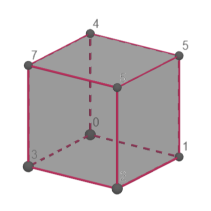
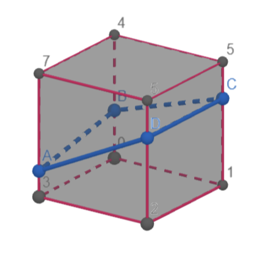
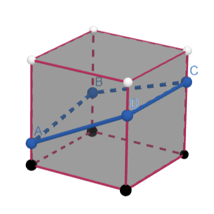

# IsoSurfaceGen

This project presents implementations of various algorithms 
for creating polygonal meshes from implicit surfaces.

## Algorithms

- Marching Cubes on uniform grids 
- Surface Nets on uniform grids 
- Dual Contouring on uniform grids 
- Adaptive Surface Nets

## Marching Cubes on uniform grids

The Marching Cubes algorithm (Lorensen & Cline, 1987) works
by following the next steps:

### 1. Dividing the 3D space into a grid of cubes.

This is straightforward. We simply divide the 
required space into a grid of cubes (voxels). 
This can be done by calculating the surface's 
bounding box or choosing an arbitrary size that 
encapsulates the shape.For simplicity,
I chose the second method.

### 2. Evaluating our implicit surface at each voxel’s corners.

|  |  |  |
|---|---|---|
|   | |   |

## Surface Nets on uniform grids
